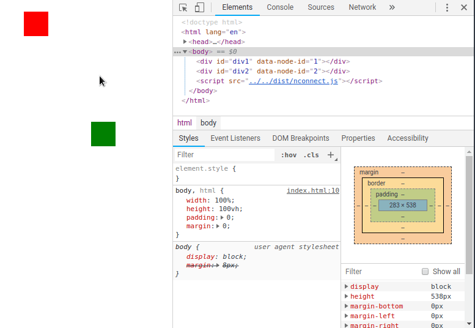

# NConnect

_A graphing library for DOM nodes_

## About this project

This is the graphing library that powered NoteConnect. While NoteConnect is a paid app, I decided to open source this library in MIT license.

## Docs

Documentations are available at [`docs/`](docs/). You can also check out [`example/`](example/) for more info on how to use it.

## License

[MIT](LICENSE.md)
